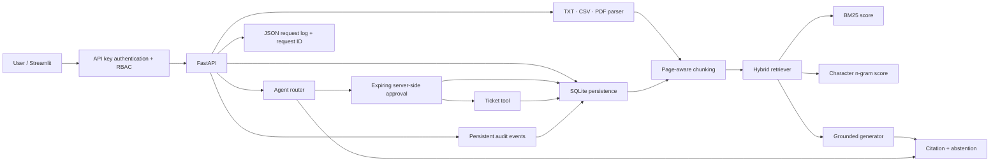

# Architecture

## Design decisions

- The default generator is extractive and deterministic, so the repository works without an API key.
- An OpenAI-compatible endpoint can be enabled through environment variables.
- Retrieval and generation are separate interfaces to make embedding models, rerankers and local LLMs replaceable.
- Ticket creation is a state-changing action and therefore uses a persisted, expiring, single-use
  approval. Approval and ticket insertion commit in one database transaction.
- Every answer exposes retrieved evidence and returns an abstention when evidence is weak.
- Source sections and tickets are persisted in SQLite; retrieval chunks are rebuilt from source
  sections on startup so indexing strategies can evolve without migrating serialized indexes.
- API keys provide reader, operator, and admin roles. Authentication may be disabled for local
  development but is mandatory in production mode.
- SQLite deployment intentionally uses one API process. The repository protocol is the migration
  boundary for a future PostgreSQL implementation.

## Production extensions

1. Replace character n-gram similarity with a multilingual embedding model.
2. Add a cross-encoder reranker and compare it against the baseline.
3. Store chunks and tickets in PostgreSQL plus a vector database.
4. Add OCR and vision-language parsing for scanned PDFs and figures.
5. Build a labelled evaluation set and perform SFT/DPO on failure cases.
